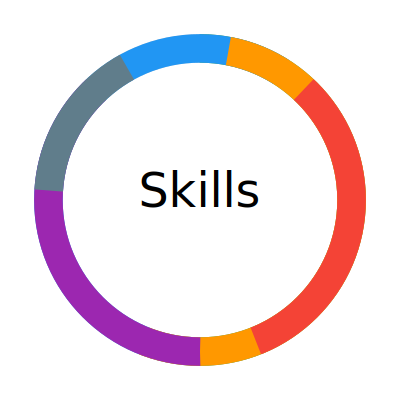

# Post-Silicon Validation & Automation Portfolio

## About Me

I am a Software Engineer by education (Master’s in Software Engineering) with over 4 years of professional experience in **post-silicon validation**, **test automation**, and **hardware protocol verification**. My expertise lies in developing scalable Python automation frameworks that interface with lab instruments, automate complex validation workflows, and integrate data analytics to accelerate debugging and improve quality.

Although my formal education is software-focused, my hands-on experience in silicon validation, PCIe protocol testing, and system-level bring-up has equipped me with strong domain knowledge bridging software and hardware.

I have also applied data science techniques — statistical modeling, predictive analytics, and visualization — as part of my validation toolchains. Cloud exposure is limited but includes familiarity with AWS services for data pipelines.

---

## Personal Statement

Passionate about bridging software and hardware through scalable automation frameworks. Continuously exploring ways to integrate AI/ML into hardware validation workflows — applying techniques such as **anomaly detection**, **LLM-based log summarization**, and **predictive modeling** to enable faster, more intelligent debugging.  
Driven to build tools that simplify complex silicon debug processes, foster cross-functional collaboration, and accelerate system bring-up cycles with actionable insights.

---

## Skill Proficiency Overview

| Skill Area               | Proficiency (%) |
|-------------------------|-----------------|
| Python Development      | 90%             |
| Post-Silicon Validation | 85%             |
| Test Automation         | 85%             |
| Data Science & ML       | 60%             |
| Data Engineering (SQL, Snowflake) | 50%     |
| Cloud (AWS exposure)    | 25%             |

---

## Skills Visualization

---

## Technical Skills

- **Languages & Libraries:** Python (Pandas, NumPy, scikit-learn, PyVISA, asyncio), SQL, R, Bash, C (basic)
- **Protocols & Hardware:** PCIe Gen2/3/4/5, JTAG, Oscilloscopes, PCIe analyzers
- **Tools & Frameworks:** PyVISA, Flask, FastAPI, Jenkins, Git, JIRA, Confluence
- **Data Analytics & Visualization:** Pandas, Matplotlib, Tableau, PowerBI, Spark, Snowflake
- **Cloud:** Familiarity with AWS (S3, EC2, Lambda)

---

## Projects

### PCIe Validation Automation Framework  
Built Python automation tools controlling lab instruments and orchestrating PCIe test cases, reducing silicon validation cycles by 30%.

### Real-Time Register Monitor  
Developed async Python tool using JTAG and XML register maps for SoC bring-up, enabling faster detection and debug of hardware link issues.

### Data-Driven Bug Analysis Tool  
Designed Python analytics scripts using Pandas and Matplotlib to identify failure trends and accelerate root cause analysis by 25%.

### Customer Feedback NLP Analytics (Personal Project)  
Created an NLP platform on AWS to analyze and visualize customer sentiment data using Python and FastAPI.

---

## Contact

[LinkedIn](https://linkedin.com/in/yasaswiniks) | [Email](mailto:ks.yasaswini23@gmail.com) | [Portfolio](https://yasaswiniks.github.io)
